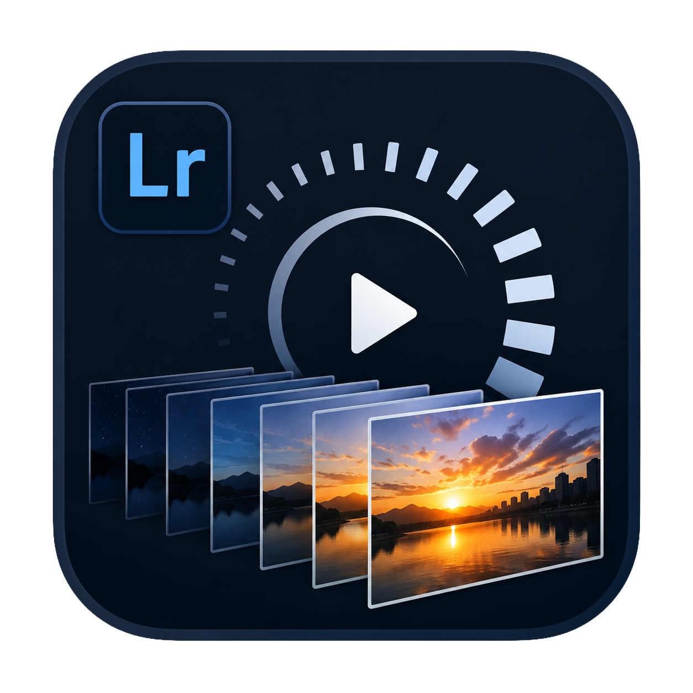

<p align="center"></p>

# Timelapse Creator — Lightroom Classic plug-in

Creates a timelapse video (H.264, H.265, or ProRes 422) from the photos
selected in Adobe Lightroom Classic, using [ffmpeg](https://ffmpeg.org) as
the encoder. The develop settings of every photo are applied, so what you
graded in Lightroom is what ends up in the video.

**Status: 0.4.0 — work in progress.** SDR pipeline complete; HDR output is
under investigation (see *HDR* below).

## Features

- 720p / 1080p / 4K output, landscape or portrait
- H.264 (libx264), H.265 (libx265, `hvc1`-tagged for Apple players), and
  ProRes 422 (Proxy/LT/standard/HQ, `.mov`) for professional editing pipelines
- Optional hardware-accelerated encoding (Apple VideoToolbox), auto-detected —
  dramatically faster, especially for H.265 (5x or more on Apple Silicon);
  quality is controlled by target bitrate instead of CRF in this mode
- Frame rate selection (24/25/30/60 fps, or a custom rate) — 1 photo = 1 frame
- Fill (center crop) or fit (black bars) aspect handling
- Quality presets plus advanced controls: CRF, encoder preset,
  **min/max keyframe interval (GOP)**, max/target bitrate
- Optional ffmpeg `deflicker` filter
- Instant frame-by-frame preview (slider + prev/next) showing each photo as
  developed, plus a fast low-resolution MP4 preview (480p/240p) opened in
  the system video player
- Save the video next to the source photos, or in a folder you choose
- Cancelable export: both the frame render and the ffmpeg encode can be
  interrupted mid-run
- UI in English and Italian

## Requirements

- Adobe Lightroom Classic 13+ (developed against LrC 15)
- **ffmpeg ≥ 4.0** on the same machine (developed and tested with 8.0.1;
  older versions may lack the `deflicker` filter, added in ffmpeg 3.4) —
  macOS: `brew install ffmpeg`. The plug-in auto-detects Homebrew/PATH
  installs; a custom path can be set in *File → Plug-in Manager → Timelapse
  Creator*.
- macOS today; the code is structured for a future Windows port.

## Installation

1. Clone or download this repository.
2. Lightroom Classic → *File → Plug-in Manager… → Add* and select the
   `TimelapseCreator.lrdevplugin` folder.
3. In the Plug-in Manager, check that ffmpeg was detected (or set its path
   manually) under the *Timelapse Creator* section.
4. Select the photos of your sequence, then run
   *File → Plug-in Extras → Create Timelapse…*

## Usage notes

- Photos are sorted by capture time; videos in the selection are skipped.
- Frames are rendered to a temporary folder via the Lightroom export engine
  (full develop settings, correct size for the chosen crop), encoded, then
  the temporary files are removed. Budget disk space for one JPEG per photo.
- The frame-by-frame preview shows each photo as developed (including its
  own crop, if any) — it does not simulate the video's target crop/fit.

## HDR

The goal is H.265 10-bit HDR output (PQ or HLG) when **all** selected photos
are HDR edits. The Lightroom SDK does not document any HDR export setting, so
the plug-in ships two diagnostic tools to probe what your Lightroom version
actually supports:

- *File → Plug-in Extras → Timelapse Diagnostics…* — probes export formats
  (AVIF/JXL/TIFF-16), speculative HDR keys, thumbnail latency and ffmpeg.
- The *"Timelapse: dump export settings"* post-process action in the Export
  dialog — export one photo with HDR output enabled and one without, then
  diff the two dumps to reveal the real HDR keys.

The ffmpeg side (10-bit, PQ/HLG tagging, `hdr10=1`) is already implemented
and unit-tested.

## Development

```sh
# unit tests for the command builder (pure Lua, no Lightroom needed)
lua tests/test_ffmpeg_command.lua

# integration test: real encodes with synthetic frames (needs ffmpeg)
sh tests/integration_ffmpeg.sh

# check that Info.lua and Version.lua declare the same version
# (they can't share code — Info.lua runs where `require` isn't available)
lua scripts/check_version.lua
```

### Releasing

1. Bump the version by hand in **both** `TimelapseCreator.lrdevplugin/Info.lua`
   (`VERSION.display`) and `TimelapseCreator.lrdevplugin/Version.lua`
   (`display`) — `lua scripts/check_version.lua` confirms they match.
2. Commit, then tag: `git tag -a vX.Y.Z -m "..."`.
3. Run `sh scripts/release.sh vX.Y.Z`. It verifies the tag matches the code
   version, checks syntax (system Lua and, for release builds, Lightroom's
   actual Lua 5.1), runs unit tests, compiles every plugin script to Lua 5.1
   bytecode (except `Info.lua`, kept as source — see the comment in that
   file) with the compiler bundled in the Lightroom Classic SDK, packages
   `TimelapseCreator.lrplugin` together with `README.md` and `LICENSE` into
   a zip under `dist/`, then — after you confirm — pushes the tag and
   publishes a GitHub release with the zip attached (`gh` CLI required).
   Requires the Lightroom Classic SDK locally (not part of this repo — see
   `ADOBE_LUAC` in `scripts/release.sh` if it's not at the default path).

The integration test also exercises hardware encoding and ProRes when run on
a machine with VideoToolbox (skipped otherwise).

See [PLAN.md](PLAN.md) for the full design and roadmap.

## License

GPL-3.0 — see [LICENSE](LICENSE).
