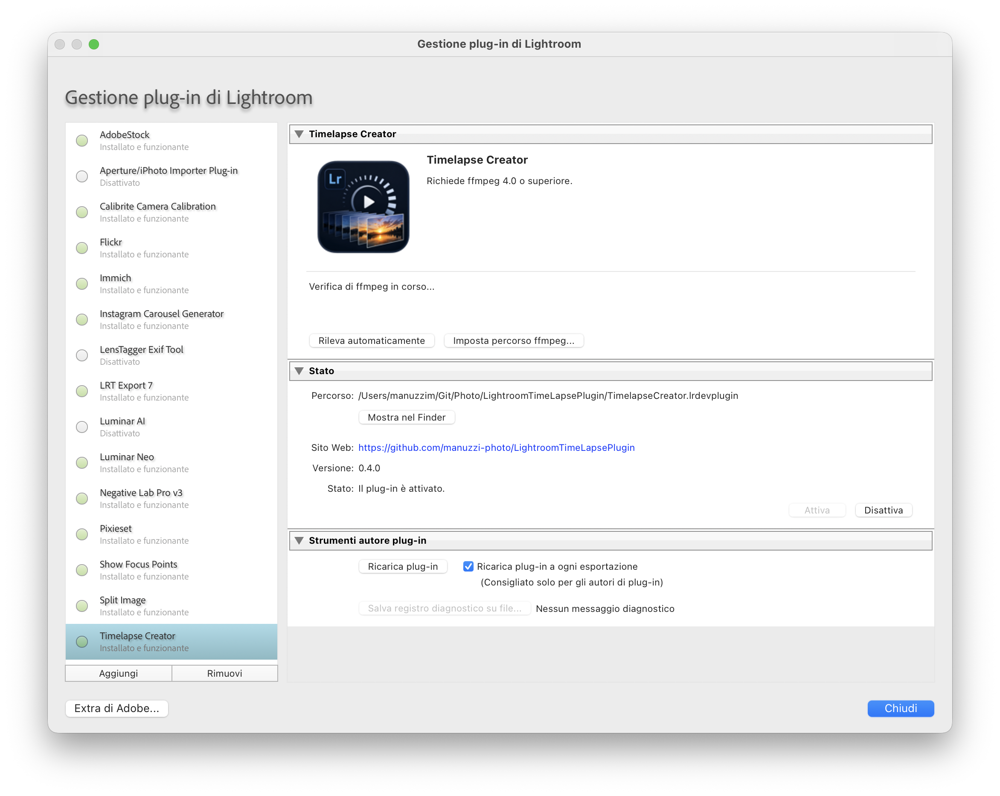
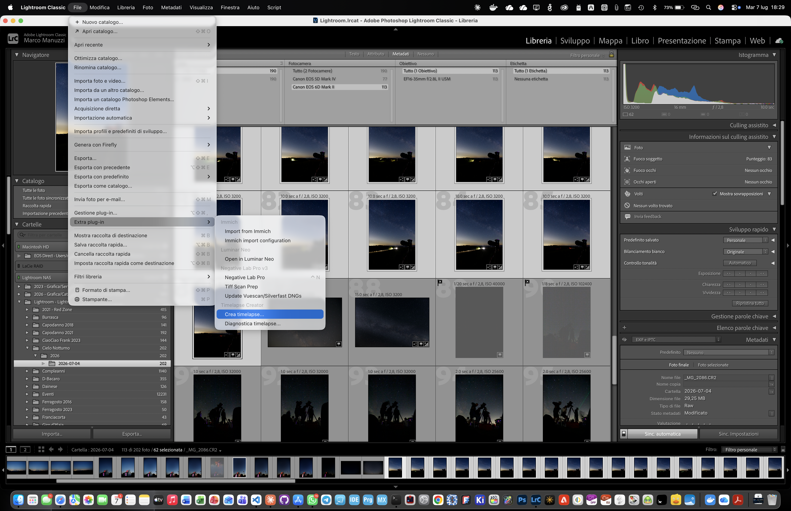
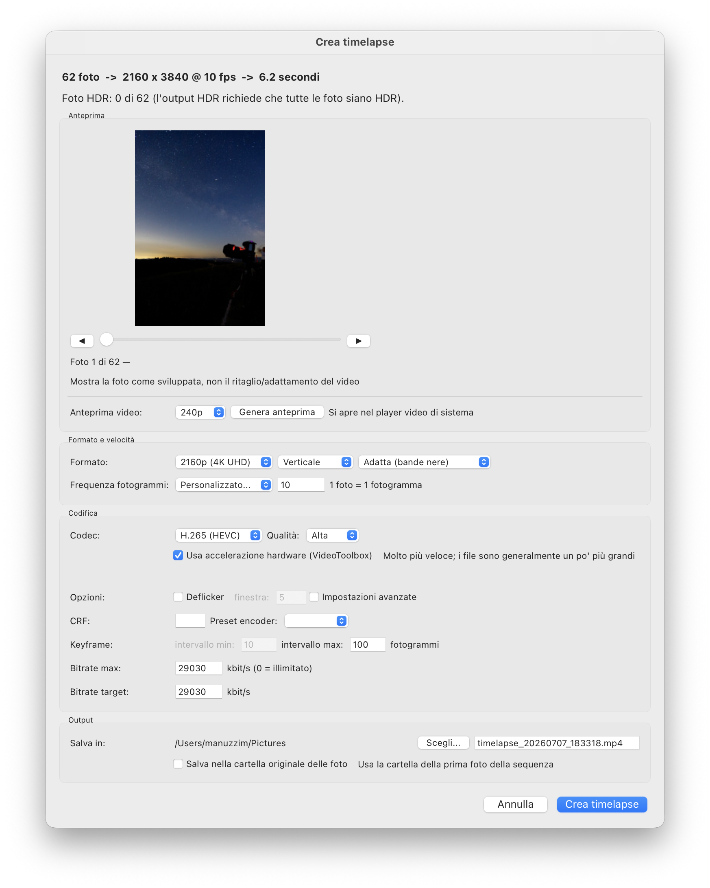

# Timelapse Creator — Guida all'uso

*English: [usage.md](usage.md)*

Questa guida illustra come verificare ffmpeg, avviare il plug-in e creare un
timelapse. Per funzionalità, requisiti e installazione del plug-in vero e
proprio, vedi il [README](../README.md) principale.

## 1. Verifica di ffmpeg in Gestione plug-in

Timelapse Creator richiede ffmpeg ≥ 4.0 sulla stessa macchina. La prima
volta che attivi il plug-in, apri *File → Gestione plug-in…* e seleziona
**Timelapse Creator** nell'elenco per vederne lo stato.

- **Rileva automaticamente** cerca ffmpeg nelle posizioni comuni (Homebrew,
  `PATH`, `/usr/local/bin`, `/opt/homebrew/bin`).
- **Imposta percorso ffmpeg…** permette di indicare un binario specifico se
  il rilevamento automatico fallisce o vuoi usare una build particolare.
- Il pannello mostra anche il percorso di installazione del plug-in, la
  versione e lo stato di attivazione.

Se ffmpeg non viene trovato, installalo prima (macOS: `brew install
ffmpeg`), poi clicca *Rileva automaticamente*.

## 2. Seleziona le foto e avvia il plug-in

Nel modulo Libreria, seleziona le foto della sequenza (gli eventuali video
nella selezione vengono ignorati; le foto sono ordinate per data/ora di
scatto indipendentemente dall'ordine di selezione). Poi apri il plug-in da:

- *File → Extra plug-in → Crea timelapse…*, oppure
- *Libreria → Extra plug-in → Crea timelapse…*

*File → Extra plug-in → Diagnostica timelapse…* è uno strumento separato e
opzionale per verificare le capacità di esportazione HDR — vedi la sezione
*HDR* del README.

## 3. La finestra Crea timelapse

La riga in alto riassume le impostazioni correnti: numero di foto,
risoluzione di output, frequenza fotogrammi e durata risultante. Subito
sotto, **Foto HDR: n di totale** indica quante foto selezionate sono
sviluppi HDR — l'output HDR completo richiede che *tutte* lo siano (vedi la
sezione *HDR* del README).

### Anteprima

- Lo slider e le frecce prev/next scorrono le foto selezionate esattamente
  come sviluppate in Lightroom (ritaglio/proporzioni delle tue impostazioni
  di sviluppo, non il ritaglio/adattamento target del video — vedi la nota
  sotto l'anteprima).
- **Genera anteprima** crea una breve clip a bassa risoluzione (240p/480p,
  scelta dal menu a tendina) e la apre nel player video di sistema, così
  puoi verificare movimento, deflicker e inquadratura prima di avviare la
  codifica completa.

### Formato e velocità

- **Formato**: risoluzione di output (720p/1080p/2160p), orientamento
  (orizzontale/verticale) e gestione delle proporzioni — **Adatta (ritaglio
  centrale)** ritaglia la foto per riempire il formato target, **Adatta
  (bande nere)** aggiunge bande nere invece di ritagliare.
- **Frequenza fotogrammi**: 24/25/30/60 fps, oppure *Personalizzato…* per
  qualsiasi valore da 0 a 240 fps. Una foto corrisponde sempre a un
  fotogramma — la frequenza controlla solo velocità di riproduzione e
  durata, non quali foto vengono incluse.

### Codifica

- **Codec**: H.264 (`libx264`), H.265/HEVC (`libx265`, taggato `hvc1` per i
  player Apple), oppure ProRes 422 (Proxy/LT/standard/HQ, salvato come
  `.mov`). I file ProRes sono circa 8–10 volte più grandi di H.264/H.265 a
  parità di durata.
- **Qualità**: preset Alta/Media/Bassa, mappati internamente su un valore
  CRF specifico per codec.
- **Usa accelerazione hardware (VideoToolbox)**: disponibile per H.264/H.265
  su Apple Silicon e sui Mac Intel supportati. Molto più veloce — spesso 5x
  o più per H.265 — a fronte di file leggermente più grandi. In questa
  modalità la qualità è controllata dal bitrate target invece che dal CRF,
  quindi i campi Bitrate diventano i controlli rilevanti al posto di
  CRF/preset.
- **Deflicker**: attiva il filtro `deflicker` di ffmpeg, con una finestra di
  mediazione configurabile, per attenuare lo sfarfallio di luminosità tra i
  fotogrammi (comune nelle pose lunghe o nelle sequenze ad apertura
  variabile).
- **Impostazioni avanzate** espone:
  - **CRF** e **Preset encoder** (solo codifica software).
  - **Keyframe**: intervallo min/max in fotogrammi — è la dimensione del
    GOP. L'intervallo minimo è disabilitato in modalità accelerazione
    hardware (VideoToolbox non lo espone).
  - **Bitrate max** (0 = illimitato) e **Bitrate target**, in kbit/s — i
    controlli più rilevanti quando l'accelerazione hardware è attiva.

### Output

- **Salva in**: scegli una cartella di destinazione, oppure spunta **Salva
  nella cartella originale delle foto** per usare la cartella della prima
  foto della sequenza.
- Il nome del file di output viene generato automaticamente
  (`timelapse_AAAAMMGG_HHMMSS.<ext>`); l'estensione segue il codec scelto
  (`.mp4` per H.264/H.265, `.mov` per ProRes).

Clicca **Crea timelapse** per avviare. I fotogrammi vengono renderizzati in
una cartella temporanea tramite il motore di esportazione di Lightroom
(impostazioni di sviluppo complete, alla dimensione implicata dal
ritaglio/adattamento scelto), poi codificati con ffmpeg; i fotogrammi
temporanei vengono infine eliminati. Sia la fase di rendering che quella di
codifica possono essere annullate durante l'esecuzione. Prevedi lo spazio
disco per un JPEG a piena dimensione per ogni foto durante la fase di
rendering.

## 4. Al termine della codifica

Al termine dell'esportazione, una finestra di conferma propone di **aprire
il video**, **mostrarlo nel file browser (Finder)** o semplicemente
**chiudere**.

## Risoluzione problemi

- **"ffmpeg non trovato"** nella finestra o in Gestione plug-in: installa
  ffmpeg (`brew install ffmpeg` su macOS) e clicca *Rileva
  automaticamente*, oppure imposta un percorso esplicito con *Imposta
  percorso ffmpeg…*.
- **Campi HDR disabilitati / 0 di n foto HDR**: l'output HDR richiede che
  ogni foto selezionata sia uno sviluppo HDR; selezioni miste ricadono su
  SDR. Usa *Diagnostica timelapse…* per verificare cosa riporta la tua
  versione di Lightroom.
- **Opzione Deflicker non disponibile**: richiede ffmpeg ≥ 3.4; aggiorna
  ffmpeg se la casella resta disabilitata.
